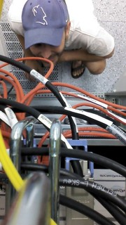

> Noi siamo quello che facciamo. -- L. Sciascia

I am interested, among other things, in universal machines for information storage and manipulation :-). I like to find out how computer systems work and how to use and manage them effectively. To be a bit more specific, I dabble in system administration (operations), security and programming. Some of the IT tools I fancy are GNU/Linux and ~~Bash~~~~[Perl](https://www.perl.org)~~Python. I try to practice the "[right tool for the job](http://catb.org/esr/writings/unix-koans/shell-tools.html)" philosophy. [I](https://github.com/jreisinger/have-done) monkey with [new](https://github.com/jreisinger/blog/blob/master/posts/devops.md) [technologies](https://github.com/jreisinger/blog/blob/master/posts/docker.md) and [languages](https://golang.org/) from time to time.

More information about me:

- formal [CV](cv.html) and [LinkedIn](https://sk.linkedin.com/in/jozefreisinger) account
- [blog](https://jreisinger.blogspot.com/) and [wiki](http://wiki.reisinge.net)
- [some](https://metacpan.org/author/REISINGE) of my [code](https://github.com/jreisinger)
- [StackExchange](https://stackexchange.com/users/1010742/jreisinger)
  and the [Monastery](http://perlmonks.org/?node_id=6364;user=reisinge)
  activities
- [tweets](https://twitter.com/JozefReisinger) and [photos](https://www.flickr.com/photos/jozrei)
- wish [list](https://amzn.com/w/23WE353M6O53S) (buy me things if you
  want to make me happy :-))

My projects:

- [profesia jobs](http://jreisinger.github.io/profesia-jobs)

Pearls I found on the Internet:

- [the saddest phone in Berlin](http://perlmonks.org/?node_id=324763)
- [How to daemonize a process](http://world.std.com/~swmcd/steven/tech/daemon.html)
- [Larry Wall on Perl, religion, and...](https://interviews.slashdot.org/story/02/09/06/1343222/larry-wall-on-perl-religion-and)
- [What problems to solve](http://genius.cat-v.org/richard-feynman/writtings/letters/problems)
- [xkcd - Lisp](https://xkcd.com/224/)

